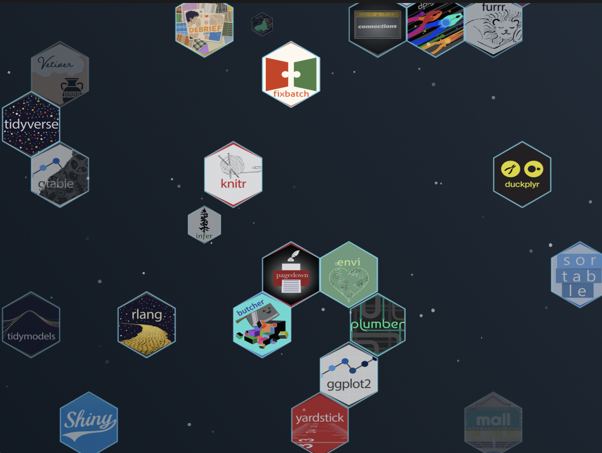

# HexVerse

A macOS screensaver that animates R package hex stickers in a honeycomb grid. Stickers grow from a single point, hold, then fade out — each at its own random speed.



## Installation

1. Download `HexVerse.saver.zip` from the [latest release](../../releases/latest)
2. Unzip it
3. Double-click `HexVerse.saver` — macOS will ask to install it
4. Open **System Settings → Screen Saver** and select **HexVerse**

> **macOS Gatekeeper:** If macOS says the file can't be opened because it's from an unidentified developer, right-click `HexVerse.saver` and choose **Open** instead.

## Build from source

Requirements: Xcode 16+, macOS 14+

```bash
git clone https://github.com/nodivbyzero/HexVerse.git
cd HexVerse
open HexSaverTestbed.xcodeproj
```

Select the **HexVerse** scheme, set configuration to **Release**, and build (`⌘B`). The `.saver` bundle will appear in DerivedData. Double-click to install.

## Adding your own stickers

Drop any `.png` files into the `stickers/` folder and rebuild. The screensaver picks them up automatically — no code changes needed.

Sticker images should ideally be hex-shaped PNGs with a transparent background, but any PNG works — it gets clipped to a hex shape at runtime.

## Stickers

Hex stickers are the intellectual property of their respective R package authors and maintainers. Many are from the [rstudio/hex-stickers](https://github.com/rstudio/hex-stickers) collection (CC0). This project uses them for non-commercial, fan/community purposes only. If you are a package author and would like your sticker removed, please open an issue.

## License

MIT — see [LICENSE](LICENSE)
